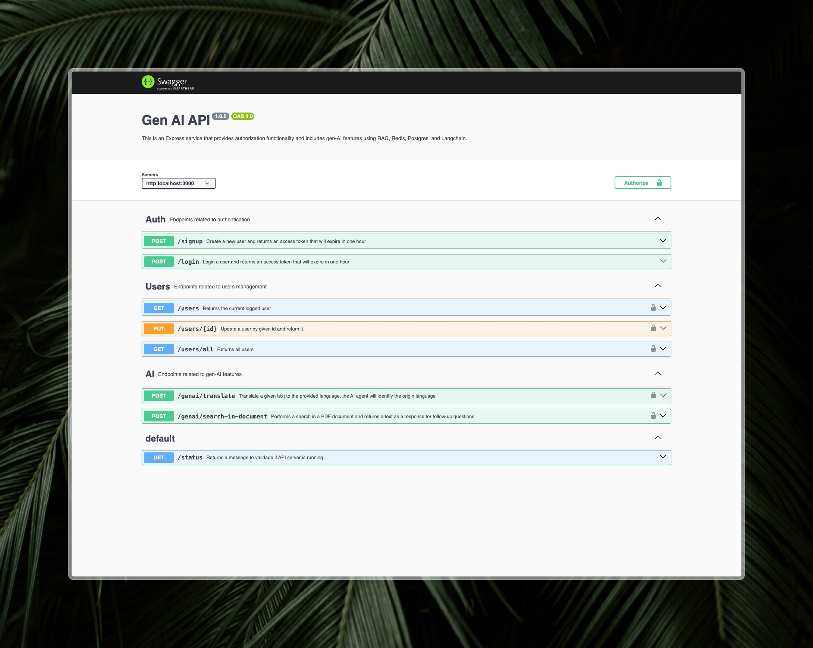

## Gen-AI API with Langchain and NodeJS

This is an Express service written in [TypeScript](https://www.typescriptlang.org/) that provides authorization functionality and includes gen-AI features, using RAG concepts, vector database and implements AI memory history with Redis DB.

<center>
  
</center>

## Resources

- [LangChain](https://js.langchain.com/docs/introduction/) for handling LLM and RAG functionality.
- [Express](https://expressjs.com/) and [Node](https://nodejs.org/en/) for creating backend service.
- [Qdrant](https://qdrant.tech/) as vector store database.
- [JWT](https://jwt.io/) for handling authentication
- [GoogleGenAI](https://v02.api.js.langchain.com/modules/_langchain_google_genai.html) langchain plugin.
- [Google Gemini - API](https://ai.google.dev/)
- [Docker](https://docs.docker.com/) Containers for setting up environment.
- [Redis](https://redis.io/) database for storing AI messages.
- [ZOD](https://zod.dev/) as body parameters validation.
- Automated [OpenAPI](https://www.openapis.org/what-is-openapi) specifications using [JsDocs](https://jsdoc.app/) and [Swagger UI](https://swagger.io/tools/swagger-ui/) for generating documentation.

## Project Structure

```yaml
common: common code and utilities for all modules
di: dependency injection container
modules: application features
  module_name:
    adapters: class adapters for external resources
      dataproviders:
      services:

    application: application layer for controllers and routes
      controllers:
      routes:

    core: application core logic
      entities:
      usecases:
      utils: class and constant utilities for this module
```

### Search In Document Flow

The search in document endpoint is the most complex of this application, it uses RAG concepts to break down the provided
PDF document into a small chunks and then use it as a context for the followup user questions. Also, it uses Redis to store
and retrieve chat history during user's session.

> As an improvement, it'll be worth to have a separated endpoint for uploading documents and another one for handling questions
> to it. To keep things easy to follow up and having a single endpoint, the diagram is as you can see below:


## Prerequisites

Before running the application, make sure you have the following installed:

- NodeJS (v20.12.1)
- PNPM (v9.7.0)
- Docker (v27.2.0)

## Running the application

1. Clone this repository

```shell
git clone https://github.com/WillACosta/genai-langchain-api
```

> Copy the `.env.example` file to `.env` and fill it with your own credentials. Get here:
> [Google Gemini](https://ai.google.dev/) | [LangChain](https://js.langchain.com/docs/introduction/)

```shell
cp .env.example .env
```

2. You'll need [Docker](https://docs.docker.com/) to setup and running the application services

> From the app's root directory, run the following command to build and running docker containers:

```shell
docker compose up --build
```

> The application will be available at `http://localhost:3000`.<br>

## Documentation

The documentation process is automated using `swagger-ui-express` and `swagger-jsdoc` libraries, on each application route definition you will find a comment with the necessary specifications for that route in particular.

During the build process the application will handle the route comments and generate the final `OpenApi` specification for the `Swagger UI`.

After that you will be able to access: `localhost:3000/docs` in your browser and see the docs.
